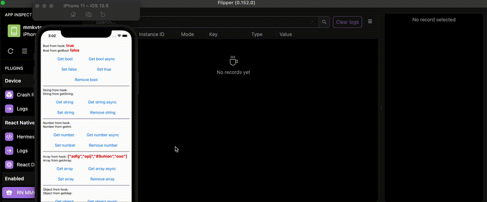

# React Native Flipper plugin for [React Native MMKV Storage](https://github.com/ammarahm-ed/react-native-mmkv-storage)

Use this with [my Flipper desktop plugin](https://github.com/pnthach95/flipper-plugin-react-native-mmkv-storage)



_* Tested on Flipper v0.152.0, React Native v0.68.2, RN MMKV Storage source code from github_

## Requirement

`react-native-mmkv-storage` v0.8.0 or newer. Older versions (from 0.6.1 to 0.7.6) are compatible but [some logs can't be shown](https://github.com/ammarahm-ed/react-native-mmkv-storage/issues/264)

## Install

```bash
yarn add react-native-flipper rn-mmkv-storage-flipper --dev
```

or

```bash
npm i react-native-flipper rn-mmkv-storage-flipper -D
```

Your code:

```js
import {MMKVLoader} from 'react-native-mmkv-storage';
import mmkvFlipper from 'rn-mmkv-storage-flipper';

const MMKV = new MMKVLoader()
  .withInstanceID('test')
  .withEncryption()
  .initialize();

if (__DEV__) {
  mmkvFlipper(MMKV);
}
```

Multiple MMKV Instances:

```js
const MMKV1 = new MMKVLoader()
  .withInstanceID('test1')
  .withEncryption()
  .initialize();

const MMKV2 = new MMKVLoader()
  .withInstanceID('test2')
  .withEncryption()
  .initialize();

if (__DEV__) {
  mmkvFlipper([MMKV1, MMKV2]);
}
```

## FAQ

### My Android app crashes nonstop

This is known [issus](https://github.com/facebook/flipper/issues/3026#issuecomment-966631294) on Flipper. The workaround is keep Flipper opening while running app on debug mode, no crashes on release.
Or run command below:
```bash
adb shell run-as "replace.this.with.your.app.id" rm -rf files/sonar
```